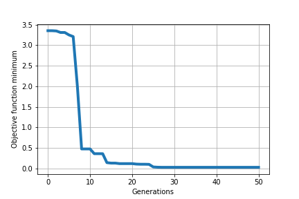

# Electromagnetism-like Optimization (EMO)
The repository **emo-model** is a demonstration of using EMO to solve optimization problems, and is under the university course *MATH4900: Senior Seminar* in the Chinese University of Hong Kong.

---

## Overview
**1. What is Electromagnetism-like Optimization?**
- Electromagnetism-like Optimization (EMO) is a relatively new population-based method for optimization
- EMO was proposed by Birbil and Fang
- EMO algorithm mimics the attraction-repulsion mechanism between charged particles in an electromagnetic field
- The basic idea of EMO is to move particles to an optimal solution using attraction and repulsion forces

**2. Inheritance from Evolutionary Computation**
- Evolutionary Computation (EC) consists of four steps:
  - **Initialize population**: generate candidates by randomness
  - **Operate and search**: perform evolutionary operators and find best candidate
  - **Natural selection**: build population of next generation
  - **Repeat process**: cycle until generation exceeds limit or requirements are satisfied
- Besides EMO, examples of EC includes Particle Swarm Optimization (PSO), Harmony Search (HS), Memetic Algorithm (MA), Differential Evolution (DE) and Genetic Algorithm (GA)

**3. Benefits and Drawbacks of EMO**
- EMO has two major benefits from EC compared to classic optimization methods such as gradient descent algorithm
  - **Higher dimension efficiency**: converges in fewer generations
  - **Global extremum**: prevents getting stuck in local extremum
- Since EMO is inspired by mechanism in electromagnetic theory, EMO has **global influence** which assumes each particle is influenced by the rest of the population
- EMO has two apparent drawbacks compared to classic optimization methods and other evolutionary computation algorithms
  - **Unstable convergence**: jumps between multiple points repeatedly
  - **High complexity**: slower computational speed
 
**4. Applications of EMO**
- EMO can solve several types of engineering problems well, including neural networks, vehicle routing and image processing

## Definitions and Concepts
**1. Definitions**
- A **search space** (`Ω` or `[l,u]`) is a non-empty feasible set bounded by boundary constraints with positive measure
- The **dimension** `d` is the dimension of the search space
- A **candidate solution** (or **particle**) `x` is a vector in a population
- A **generation (gen)** is a state relative to number of attempts within the process
- The **population size** `m` resticts number of particles in one generation
- The **objective function** `f` is a function that maps from `[l,u]` to the set of real numbers
- The **objective function value (ofv)** of a particle `f(x)` is given when the candidate solution is passed into the objective function
- The **length step** `δ` is a length of the search space used within the process
- The **maximum number of local search iterations** `LSITER` is the limit of iterations for local search stage in the process

**2. Process**
- EMO follows the process as follows:
  - **Initialization**: generate random particles according to population size over the search space
  - **Local search**: perform local search on particles for better objective function value within its neighbourhood
  - **Total force vector**: calculate charges and forces for each particle in the population
  - **Movement**: each particle is displaced according the total force
- The process is complete either when the number of generations exceeds or objective function minimum is smaller than the threshold `ε`

**3. Local Search**
- Local search stage in EMO can be categorized in three types:
  - No local search
  - Local search for best particle
  - Local search for population
- In this stage, the selected particle `x` will first stored in temporal varible `y`
- After that `x` moves in random length depending on `δ` and in random direction to a new position
- Their objective function value is compared and the particle with smaller value keeps
- The stage ends by a successful replacement or exceeding `LSITER`

**4. Total Force Vector**
- Before entering the main stage of total force vector, it is important to understand two principles from the study of electromagnetism:
  - **Coulomb's law** where the attraction or repulsion force between two particles is directly proportional to the product of charges of particles, and inversely proportional to the square of distance between them
  - **Superposition** which states that the resulting force (vector) is equal to the sum of all forces (vectors)
- With basic understanding of Coulomb’s law, we need to know two important things for calculation:
  - **Charge magnitude**: what determines the magnitude of the charge of a particle
  - **Attraction and repulsion**: what determines the attraction and repulsion between two particles
- Charge magnitude of a particle depends on the difference between ofvs of current particle and best particle
  - The larger the difference, the smaller the charge the particle has
  - Because of this definition, population size depends on dimension of sample space
- For a particle `x`, each force exerted from another particle `w` depends on the ofv
  - If the ofv of `w` is smaller than that of `x`, `x` is attracted to `w`, vice versa
- The resultant force of a particle is the sum of the forces and then normalized, since only the direction of the total force vector is considered

**5. Movement**
- The best particle remains in position, while other particles move according to their position vector
- Process of EMO stops when number of generations exceeds or objective function minimum is optimal

## Examples
- Rosenbrock function is used to demonstrate the process of EMO:

> **Rosenbrock Sample 1: Local search on best particle**
> 
> 
> 

> **Rosenbrock Sample 2: Local search on best particle**
> 
> 
> 

## Analysis
**1. Complexity**
- Complexity over different steps:
  - Initialization: `O(m*d)` random functions + `O(m*d)` arithmetic operations -> `O(m*d)`
  - Local search: (`O(d)` random functions + `O(d)` arithmetic operations + `O(d)` comparisons) per iteration per particle -> `O(LSITER*d)` for best particle, `O(LSITER*m*d)` for population
  - Total force vector: (`O(m*d)` arithmetic operations + `O(m*d)` comparisons) per particle -> `O(m^2*d)`
  - Movement: `O(m*d)` random functions + `O(m*d)` arithmetic operations -> `O(m*d)`
- Total complexity: `O(gen*m^2*d)`
- Complexity for gradient descent is `O(gen*d^2)`

**2: Convergence**
- Proof of convergence of EMO is difficult to provide due to its unstability and randomness
- Under the same condition as in previous demonstration, an average of 24 generations can fulfill the above requirement
- However, the variance is as high as 463

**3: Beauty of Attraction and Repulsion**
- An important benefit of EMO is that a global minima (or maxima) can be attained instead of local, and this is due to the beatiful design of attraction and repulsion mechanism
- In order to make finding global extremum effective, the following points has to handle well:
  - **Bad ofv**: a particle should move away from particles with bad objective function values
  - **Good ofv**: a particle should move towards particles with good objective function values
  - **Best ofv**: a particle should move away from the neighbourhood of the best particle
- EMO does the following handle for attraction and repulsion:
  - The best particle does not move
  - A particle with lower ofv will attract another particle with higher ofv to its direction

  - A particle with higher ofv will repulse another particle with lower ofv away from its direction

- The beauty of attraction and repulsion comes from two things:
  - The best particle does not move (which means it is not affected by repulsion), but it will attract other particles to move close to the best particle
  - When some particles are close to the best particle in a generation, other particles with higher ofv will provide repulsion force to push away those particles in the next generation, so instead of many particles sticking near a local minima, those particles can wander nearby the local minima and may find a better local minima

**4: Local Search Modes**
- Recall there are three types of local search for EMO process:
  - No local search (Mode 0)
  - Local search for best particle (Mode 1)
  - Local search for population (Mode 2)
- Below are box-and-whisker plots of 20 samples for each mode
  - For each sample, the ofv minimum is obtained, put in logarithmic base 10 and flip the negative sign

- By looking at the median, the ascending order is no local search, local search for best particle and then local search for population
- There is more obvious difference between with and without local search, and as the ofv minimum is near global minimum, it is nearly impossible to improve without local search
- Local search for best particle is enough since local search for population has similar results, but with much higher computation time
- Also, by looking at quartiles, extremum and outliers, it shows again that convergence of EMO is unpredictable

**5: Higher Dimensions**
- A common way to test the performance of optimization algorithms in higher dimensions is Ackley function

> **Ackley Sample: Local search on best particle**
> 
> 
> 

## Extensions
- Hybridizing EMO with descent search (HEMO), which can give better results under stricter conditions to guarantee convergence
- EMO with fixed search pattern (FEMO), which can reduce the minimum population size required for efficiency
- Constrained EMO (CEM), which has good concentration on minimizing ofv under a large search space
- Penalty-based EMO (PEM), which replaces search space boundaries with penalty functions

---

## References
- D. Oliva and E. Cuevas, *Advances and Applications of Optimised Algorithms in Image Processing*, Springer, 2007
- M.M. Ali, M. Golakikhani, *An electromagnetism-like method for nonlinearly constrained global optimization*, Computer & Mathematics with Applications Volume 60 Issue 8, 2010 (https://www.sciencedirect.com/science/article/pii/S0898122110005821)
- S. Surjanovic, D. Bingham, *Optimization Test Functions: Ackley Function*, Simon Fraser University, 2013 (https://www.sfu.ca/~ssurjano/ackley.html)

## Remarks
- All documents are prohibited to redistribute in any means.
- The author fully respects [**Honesty in Academic Work**](https://www.cuhk.edu.hk/policy/academichonesty) from *The Chinese University of Hong Kong (CUHK)* and will not take any responsibility for all acts of academic dishonesty.
